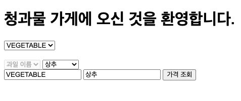

# 청과물 가게

> 기능 별로 세부 내용은 `Issues` 를 참고해주세요!

### 1. 시작 페이지


### 2. 청과물 종류를 선택하고 청과물을 선택합니다.

- 청과물 종류 선택에 따라 선택된 청과물의 이름이 있는 드랍다운 박스가 활성화 됩니다.
- 선택된 청과물 종류는 readOnly 입니다.
- 청과물 이름은 편의상 자동 입력되지만 수정 가능합니다.



### 3. 버튼을 클릭하면 청과물 이름과 가격이 조회됩니다.


---

## 1. 실행 방법

```shell
# 1. war 생성
> ./gradlew bootwar
BUILD SUCCESSFUL in 6s

> ls build/libs
greengrocery-store-0.0.1-SNAPSHOT.war

# 2. war 실행
> java -jar build/libs/greengrocery-store-0.0.1-SNAPSHOT.war
... Started GreengroceryStoreApplication in 4.513 seconds (JVM running for 5.048)

# 3. http://localhost:8080/index 접속
```

## 2. 환경

- springboot 2.5.2
- webClient
- thymeleaf
